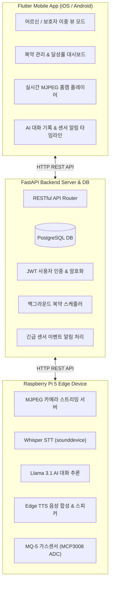

# 🌿 OASIS (임베디드 기반 노인 케어 AI 음성 챗봇)

> **"집 안의 위험은 센서와 카메라가 감지하고, 보호자는 앱으로 확인하며, 어르신은 음성으로 자연스럽게 상호작용합니다."**

---

## 📌 1. 프로젝트 개요

초고령사회 진입 및 독거노인 가구 증가에 따라 고독사 및 돌봄 공백이 심각한 사회적 문제로 대두되고 있습니다.  
**OASIS**는 단순 대기형 스피커를 넘어 **임베디드 엣지 디바이스**, **AI 음성 대화 파이프라인**, **보호자 전용 모바일 앱**을 하나로 결합하여 어르신의 안전 및 정서 케어를 능동적으로 보살피는 통합 케어 솔루션입니다.

---

## 🌟 2. 주요 기능 (Key Features)

### 🎙️ AI 음성 대화 파이프라인
* **초고속 음성 인식(STT)**: Groq Whisper API를 활용하여 수백 ms 내에 음성을 한국어 텍스트로 변환
* **어르신 맞춤형 대화(LLM)**: Llama 3.1 기반 말벗 대화, 정서적 고립감 해소 및 생활 정보/날씨 안내
* **자연스러운 음성 합성(TTS)**: Microsoft Edge TTS를 적용하여 어르신 맞춤형 발화 속도와 명확한 한국어 음성 출력

### 📹 라즈베리파이 홈캠 모니터링
* **저지연 영상 스트리밍**: Raspberry Pi 5 카메라 모듈 기반 MJPEG 실시간 스트리밍 송출
* **무중단 백그라운드 운영**: `systemd` 서비스 등록으로 부팅 시 자동 데몬 실행 및 네트워크 끊김 시 백그라운드 자동 재연결

### 🚨 센서 기반 위험 감지 & 긴급 알림
* **실시간 가스 누출 감지**: MCP3008 ADC 칩과 MQ-5 가스 센서로 아날로그 전압을 계측하여 임계값 초과 시 즉시 이상 감지
* **즉각적 긴급 전파**: 센서 감지 즉시 FastAPI 백엔드로 긴급 POST 전송 ➔ 보호자 앱 긴급 경고 배너 표출 및 라즈베리파이 스피커 비프음/대피 음성 송출

### 💊 맞춤형 복약 알림 시스템
* **복약 일정 CRUD 관리**: 보호자가 약 이름 및 복용 시각을 자유롭게 관리
* **음성 자동 안내 & 달성률 시각화**: 정해진 시간에 스피커 안내 음성 자동 송출, 앱 내 오늘 복약 달성률(%) 프로그레스 바 제공

### 📱 사용자 맞춤형 이중 뷰 (Dual View)
* **어르신용 화면 (Senior View)**: 큰 글씨, 큼직한 아이콘의 직관적 UI, 무터치 음성 상호작용, 원터치 SOS 긴급 버튼
* **보호자용 화면 (Guardian View)**: 실시간 영상 모니터링, 복약 달성률 통계, 이상 징후 푸시 알림, AI 대화 기록 타임라인 열람

---

## 🏗️ 3. 시스템 아키텍처 (System Architecture)

### 🔄 라즈베리파이 음성 대화 파이프라인
`마이크 음성 입력 (sounddevice 16kHz PCM)` ➔ `Groq Whisper STT` ➔ `Llama 3.1 LLM 응답 생성` ➔ `Edge TTS 음성 합성` ➔ `스피커 출력`

---

## 🛠️ 4. 기술 스택 (Tech Stack)

| 구분 | 기술 스택 |
| :--- | :--- |
| **Embedded & Edge** | Raspberry Pi 5, Python 3.11, sounddevice, MCP3008 ADC, MQ-5 Gas Sensor |
| **AI Engine** | Groq Whisper API (STT), Meta Llama 3.1 (LLM), Microsoft Edge-TTS (TTS) |
| **Backend & Server** | FastAPI, PostgreSQL, SQLAlchemy, JWT Authentication, Asyncio Scheduler |
| **Frontend & App** | Flutter (Dart), MJPEG Streaming Player, Provider / Riverpod |
| **Infra & DevOps** | systemd (Auto-start), Git & GitHub |

---

## 👥 5. 팀원 소개 및 업무 분담 (Team Roles & Responsibilities)

| 이름 | 역할 |
| :---: | :--- |
| **노아현** | **팀장 / 백엔드 & 서버** |
| **최대영** | 라즈베리파이 / AI |
| **김다혜** | 프론트엔드 / 관리 앱 |

 

### 👑 노아현 (팀장 / 백엔드 & 서버 담당)
* **프로젝트 총괄**: 전체 개발 일정 관리, 교수님 면담 진행 및 시스템 종합 아키텍처 설계
* **백엔드 서버 구축**: FastAPI 프레임워크 기반 RESTful API 라우터 설계 및 서버 아키텍처 구성
* **데이터베이스 설계**: PostgreSQL 관계형 데이터베이스 모델링 및 데이터 영속성 관리
* **인증 및 보안**: JWT 기반 사용자 인증 체계 구축 및 민감 대화 데이터 암호화 저장 처리
* **비동기 스케줄러 & 알림**: 백그라운드 복약 알림 스케줄러 개발 및 MQ-5 가스 감지 긴급 알림 수신 API 구축

### 🤖 최대영 (라즈베리파이 / AI 담당)
* **임베디드 환경 구축**: 라즈베리파이 OS 환경 세팅, 개발환경 구성 및 `systemd` 자동 실행 서비스 등록
* **음성 파이프라인 통합**: `sounddevice` 기반 음성 수집(16kHz PCM), Groq Whisper STT, Llama 3.1 LLM, Edge TTS 연동 및 파이프라인 구동
* **프롬프트 엔지니어링**: 어르신 맞춤형 친근한 어조의 Llama 3.1 대화 프롬프트 튜닝
* **하드웨어 센서 연동**: MCP3008 ADC 칩과 SPI 통신을 활용한 MQ-5 가스 감지 하드웨어 회로 구현 및 데이터 수집

### 📱 김다혜 (프론트엔드 / 관리 앱 담당)
* **UI/UX 전면 설계**: Flutter 프레임워크 기반 크로스 플랫폼 모바일 앱 UI/UX 기획 및 디자인
* **이중 뷰 (Dual View) 구현**:
  * **어르신용 화면**: 고대비 컬러, 큰 글씨/버튼 중심의 단순 UI 및 원터치 긴급 SOS 기능
  * **보호자용 화면**: 원격 모니터링 및 상태 관리 대시보드
* **타임라인 & 대시보드**: 어르신-AI 간 대화 기록 타임라인, 실시간 이상 감지 알림 타임라인 제작
* **복약 시각화 & 홈캠 연동**: 복약 일정 CRUD 및 일일 달성률(%) 프로그레스 바 구현, 실시간 MJPEG 홈캠 영상 스트리밍 연동

---

## 🔗 6. 저장소 정보

* **GitHub Repository**: [https://github.com/NohAhyeon/SW_Project](https://github.com/NohAhyeon/SW_Project)
* **팀명**: 팀 OASIS
